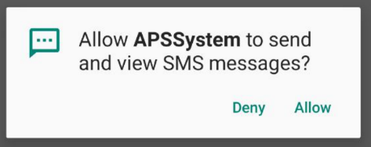
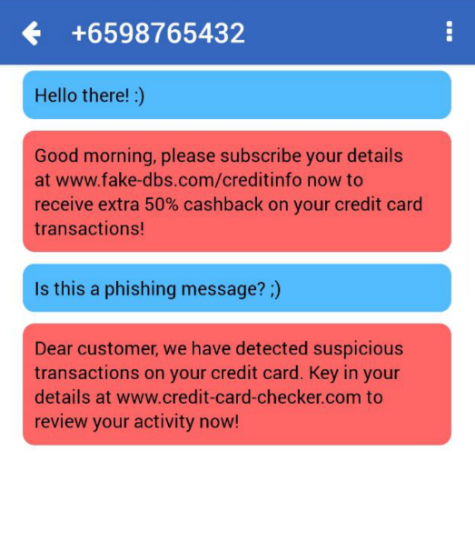

# Anti-Phishing SMS (APS) System

## Main Concept

The APS System project is a platform that helps combat cyber threats involving phishing attacks. With rising cyber threats in Singapore and phishing attacks seeing the biggest jump in 2018, there should be efforts made to help mitigate this problem.

The APS system aims to become a new layer of cybersecurity protection that uses Machine Learning (ML) techniques to detect plausible phishing SMS messages and flags them out with reasons for suspicions, which can also help to educate users on what to spot for phishing signs and to enable them to make more well-informed decisions with valuable information provided by this system.


## Inspiration
Currently, effort is focused on educational platforms that teaches manual detection for phishing attempts. Furthermore, these platforms may not be highly utilized due to reasons like laziness or complacency. The APS system acts as an additional layer that protects users regardless of their proficiency in manually detecting phishing attempts and allows them to make more well-informed decisions when it comes to trusting SMS messages.

The target audience is non-tech-savvy individuals like elderlies who cannot detect phishing messages, although everyone with access to phone messaging functionalities would also be able to benefit from valuable information provided by the APS system. The type of data to be used will include phishing emails because it is publicly available, however further data refinements may be required since messages are shorter and phishing content is usually largely similar to legitimate ones.

## Getting Started

### Installing
1. Download the APK file from the latest release in the [releases section](https://github.com/tanyonghe/APS-System/releases).
2. Run the APK file in your Android phone to install APS System.
3. Open the application and grant permission for APS System to read your SMS messages.




### Usage
Send yourself an SMS and watch suspected phishing messages appear in a red textbox!



Example Safe Messages:
```
Hello World!
Let's meet at 6.30pm!
Hey, how are you feeling today? :)
```

Example Phishing Messages:
``` 
Hello there, please subscribe your details at www.fake-dbs.com/creditinfo now to receive extra 50% cashback on your credit card transactions!
Dear customer, we have detected suspicious transactions on your credit card. Key in your details at www.credit-card-checker.com to review your activity now!
```


## Application Workflow
1. APS System runs (even in background) to receive SMS messages.
2. The appURL-encodes message body and attaches it to a crafted GET request.
3. The app then sends the GET request to the deployed model at [PythonAnywhere](http://apssystem.pythonanywhere.com).
4. The app receives a return response in the form of {"model":"rfc","phishing":"0"} where the value of "phishing" is "1" for suspected phishing and "0" for safe messages.
5. APS System stores SMS details and results via AsyncStorage and displays it within the app.
6. User gets alerted via phone notification if a phishing SMS message is detected.


## Features Implemented
* AsyncStorage for Local Storage
* Model Deployment (on PythonAnywhere)
* SMS Reading (within app and in background)
* Fetch and Display Model Predictions
* Notification Alert for Suspected Phishing


## Challenges Faced
It was tough learning JavaScript ES6 and using React Native to develop a mobile application whilst balancing internship workload throughout the months.


## What's next for APS System
1. Implement Warning Education System
2. Fix Bugs:
- Multiple SMS Listeners that were unintentionally set up each time ComponentDidUpdate runs
3. Improve SMS Phishing Detection Model:
- SMS Corpus Dataset used is very biased towards the nature of the messages (i.e. conversational style) the model was trained on
- Have to cater more towards "smarter" phishing messages that make use of URL typosquatting or formal writing to look legitimate
4. Implement Minor Features:
- Menu Feature
- Settings Feature
- Search Feature
5. iOS Version


## Built With

* [React Native](https://facebook.github.io/react-native/) - App Development
* [Jupyter Notebook](https://jupyter.org/) - Model Training
* [PythonAnywhere](https://www.pythonanywhere.com/) - Model Deployment

## Author

* **Tan Yong He**


## Acknowledgments

* Hat tip to anyone whose code was used
* Inspiration
